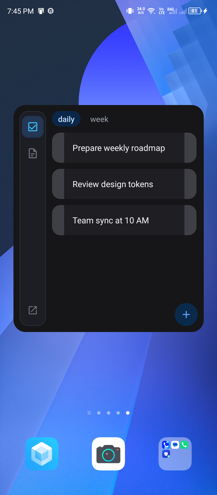
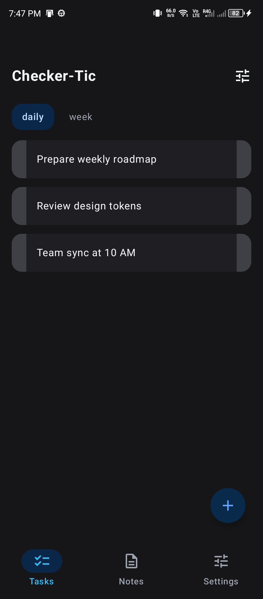
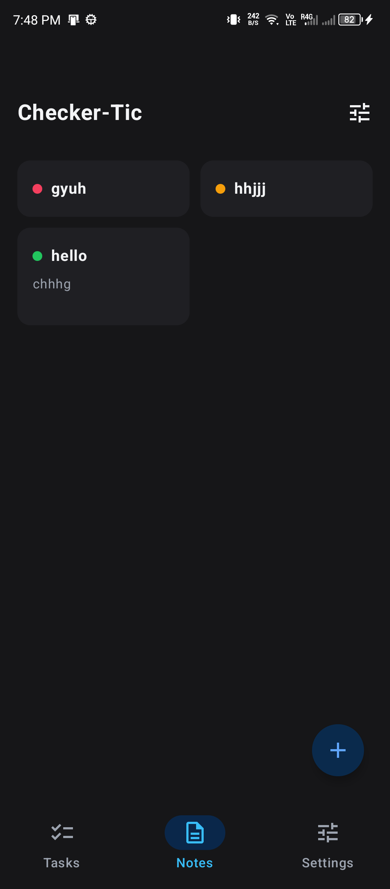
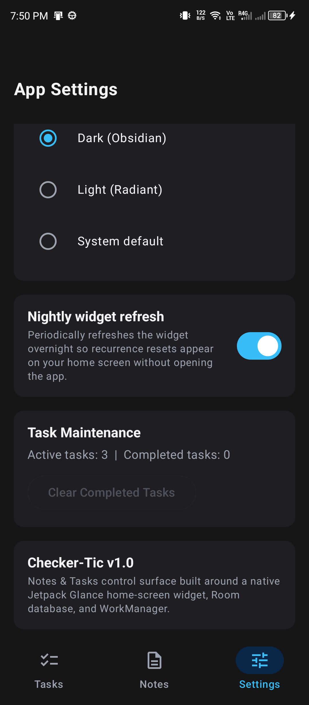

# Checker-Tic

A widget-first task and note management system for Android, built with Jetpack Glance, Jetpack Compose, and Room. Checker-Tic is engineered around the principle that daily task interactions belong directly on the launcher home screen rather than locked inside deep application hierarchies.

---

## Visual Overview

| Home Screen Glance Widget | In-App Tasks Surface |
|---|---|
|  |  |

| Staggered Notes Grid | System & Recurrence Settings |
|---|---|
|  |  |

---

## Core Capabilities

### 1. Home-Screen Glance Widget
- **Floating Sidebar Dock**: 14dp rounded floating navigation dock with 10dp outer margins, isolating navigation from widget boundaries without clipping.
- **Instant Reactive Invalidation**: Leverages DataStore timestamp update ticks (`UPDATE_TICK_KEY`) to trigger immediate Compose runtime recomposition and fresh Room database queries upon any state mutation.
- **Two-Phase Completion Blink**: Visual feedback mechanism transitioning through active state before marking tasks complete and removing them from the active list.
- **Trampoline Quick-Add**: Direct floating action button triggering lightweight dialogs (`QuickAddActivity`) to insert tasks or notes with full content straight from the launcher.
- **Adaptive RemoteViews Layout**: Guaranteed vertical spacing between task items in Glance `LazyColumn` adapters.

### 2. Full Application Surface
- **Category Filter Rows**: Clean category selector with real-time task filtering and category-level recurrence rules.
- **Reverse-Chronological Ordering**: Newly created tasks immediately appear at the top of both in-app and widget lists for instant access.
- **Note Composer**: Auto-saving note editor and multi-column staggered view with creation-time content input.
- **Soft Keyboard IME Integration**: Single-tap task creation supporting keyboard "Done" actions with automatic focus allocation.

### 3. Data & Recurrence Engine
- **Lazy On-Read Reset**: Recurrence periods (daily, weekly, monthly, custom interval buckets) are computed on read using deterministic period keys, guaranteeing freshness without relying on background job execution for correctness.
- **Persistent Completion History**: Append-only event store (`task_completions`) recording timestamps for analytics and streak calculation.
- **Room Database Architecture**: SQLite database running in WAL mode with Foreign Key constraints and reactive Kotlin Coroutines `Flow` streams.

---

## Technical Architecture

| Layer | Component | Description |
|---|---|---|
| **Widget UI** | Android Jetpack Glance | Declarative widget UI compiled to RemoteViews |
| **App UI** | Jetpack Compose / Material 3 | Full-screen interactive application interface |
| **Language** | Kotlin | Modern idioms, Coroutines, StateFlow |
| **Persistence** | Android Room | SQLite ORM with Category, Task, Completion, Note entities |
| **Background** | AndroidX WorkManager | Nightly widget synchronization and periodic refresh |
| **Min SDK** | API 26 (Android 8.0) | Supported on 95%+ of active Android devices |
| **Target SDK** | API 37 | Current Android standard |

---

## Project Structure

```
app/src/main/java/com/leo/checkertic/
├── data/
│   ├── dao/                 # Room DAOs (TaskDao, CategoryDao, NoteDao)
│   ├── entity/              # Entities (Task, Category, Completion, Note)
│   ├── repository/          # Business logic and lazy recurrence reset engine
│   └── AppDatabase.kt       # Room database configuration
├── ui/
│   ├── components/          # Reusable Compose items (TaskItem, NoteCard)
│   ├── screens/             # UI destinations (TasksScreen, NotesScreen, SettingsScreen)
│   ├── theme/               # Centralized Obsidian Copper & Radiant Light tokens
│   ├── trampoline/          # QuickAddActivity and NotePopupActivity
│   └── viewmodel/           # TasksViewModel, NotesViewModel, SettingsViewModel
├── widget/
│   ├── CheckerTicWidget.kt         # Jetpack Glance widget implementation
│   ├── CheckerTicWidgetReceiver.kt # Broadcast receiver entrypoint
│   └── WidgetUpdater.kt            # Synchronous DataStore & Glance update dispatcher
├── work/
│   └── WidgetRefreshWorker.kt      # Scheduled periodic WorkManager task
└── MainActivity.kt          # Host Activity and Navigation setup
```

---

## Design & Theming

Checker-Tic enforces strict design integrity:
- **Zero Hardcoded Colors**: Colors are mapped to centralized design tokens defined in `ui/theme/Color.kt` and `ui/theme/Theme.kt`.
- **Obsidian Copper & Radiant Light**: High-contrast, authentic color hierarchy featuring deep slate containers (`#1C1E24`), midnight surfaces (`#121316`), and crisp accent highlights.
- **Structural Typography**: Clean geometry without decorative badges or unprompted pill labels.

---

## Building and Verification

### Prerequisites
- Android Studio Ladybug or later / Android SDK Platform 37
- JDK 17 or later

### Assemble Debug APK
```bash
./gradlew assembleDebug
```

### Run Unit Tests
```bash
./gradlew test
```

### Install Directly to Connected Device
```bash
./gradlew installDebug
```

---

## License

This project is licensed under the MIT License.
